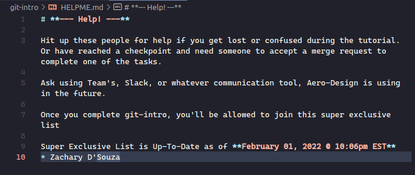
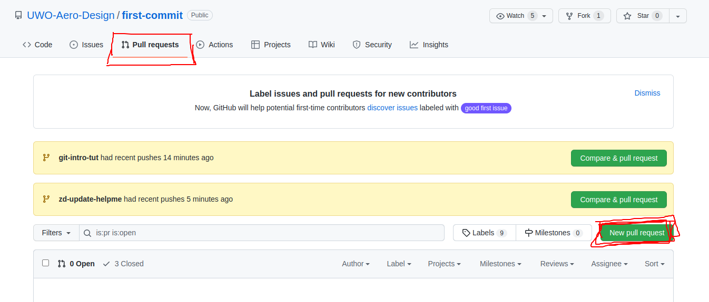
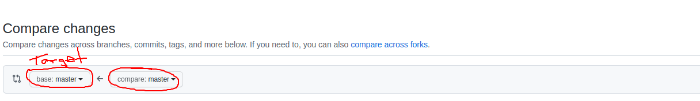
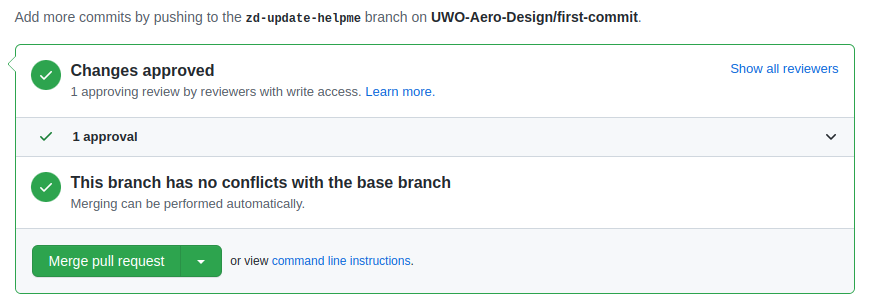
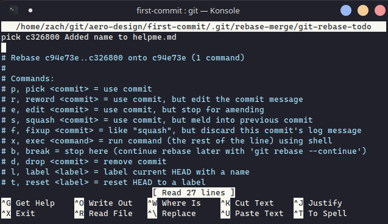
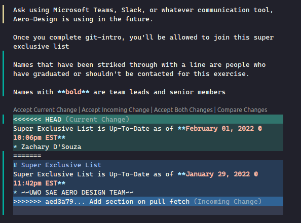

# **Welcome to UWO Aero Design Intro to Git**

This is to serve as a tutorial for onboarding new members who may have never used git before.

## **Table of Contents**
* [What Will you Learn](#what-will-you-learn)
* [Housekeeping / What to Expect](#housekeeping)
* [What you Need](#what-you-need)
* [Help](#help)
* [Extra for Windows Users](#window-users)
* [Start Tutorial](#lets-start)
  * [Branches and Git Checkout](#branches-and-git--checkout--branch)
  * [Contributing](#contributing-code-and-git--add--commit--push)
    * [Git Add](#git-add)
    * [Git Commit](#git-commit)
    * [Git Push](#git-push)
  * [Rebase Round 1](#git-rebase)
  * [Adding your name to HELPME.md](#helpmemd)
  * [Resolving Conflicts](#conflicts-if-any)
  * [Git Pull and Fetch](#updating-local-and-git--fetch--pull)
  * [Rebase Round 2](#git-rebase-round-2)
* [Congratulations](#congratulations)

## **What Will You learn**
The code changes will be incredibly simple but done in a convoluted manner to explain how to use git commands such as add, commit, push, fetch, as well as a short intro to the interactive rebase.

## **Housekeeping**
* The time required to complete this tutorial will vary based on how quickly someone can respond to the merge requests. Assuming no wait time:
  * If you already know git, this tutorial should be <1 hour
  * If you have no experience then expect about 1-3 hours
* This tutorial assumes you have some sort of programming language compiler or interpreter installed on your computer so that you can actually run code. [Installation instructions](#what-you-need).
* The majority of this tutorial will be using the command line, members are free to use GUI based git tools, but they won't be covered here. (It's possible to complete this tutorial using GUI based tools so if you feel more comfortable using them, definitely do so!, there just won't be examples for it)
* This tutorial assumes you have no prior knowledge other than what a terminal is. If you dont know what a terminal is [Start Here](https://www.youtube.com/watch?v=mUXVBMhr7Xg)
* This tutorial was performed using Linux, but there is no reason why the steps can't be followed on Mac and Windows. Windows users, see the [Windows Users Section](#windows-users) for more information.

# **What you Need**
Above it was mentioned that you need a programming langauge installed to be able to complete the tutorial aswell as some kind of text editor or ide and lastly git. If you dont have those things then I have linked some videos below to get you setup. One of python or c++ is alright, both aren't necessary unless you want both. Depending on how long it has been since these were updated, newer versions of python may be out so, just install the most recent version available.
* [Install VScode on Windows, Mac and Linux](https://code.visualstudio.com/download)
* [Setup C++ on Windows](https://www.youtube.com/watch?v=jvg4VtYEhKU)
* [Setup C++ on Mac](https://www.youtube.com/watch?v=KhGnYWplLVo)
* [Setup C++ on Linux](https://www.youtube.com/watch?v=BEJUdkPemYY)
* [Setup Python on Windows](https://www.youtube.com/watch?v=i-MuSAwgwCU)
* [Setup Python on Mac](https://www.youtube.com/watch?v=TgA4ObrowRg)
* [Setup Python on Linux](https://www.youtube.com/watch?v=Br2xt6B57SA)
* [git on Windows](#windows-users)
* [git on Mac](https://www.youtube.com/watch?v=F02LEVYEmQw)
* [git on Linux](https://www.youtube.com/watch?v=PLQQ3tJwBJg)

## **HELP**
If you need help at point during the tutorial dont be afraid to ask. Check out [HELPME.md](HELPME.md) which contains an updated list of people that have already completed the tutorial or are familiar with the material.
  
  
## **Windows Users**
If you're on Windows computer, I highly recommend installing the [Windows Terminal from the Microsoft Store](https://www.microsoft.com/en-ca/p/windows-terminal/9n0dx20hk701?activetab=pivot:overviewtab) and using powershell. Using powershell will allow you to use git commands from the command line without opening another window on your screen.

[Setting up git and powershell](https://www.youtube.com/watch?v=Tg1t3_NzJo4)

I would also recommend setting powershell to be the default terminal for VSCode (assuming you use VSCode). This way all terminal commands should be the same across Windows, Mac, and Linux. [How to change default shell in VSCode](https://www.youtube.com/watch?v=m-fXFyWYwdc)
  

## **Let's Start**
To begin, lets create a directory to store anything Aero Design related. Open a terminal and navigate to the directory you want to create your new aero-design folder within. You can do this part with a regular file manager as well.

1. Type `cd path/to/somewhere/` to navigate to inside the `somewhere/` folder. Replace path/to/somewhere with a proper file path

1. Type `mkdir aero-design` to create a new directory

1. Type `cd aero-design` to navigate to inside the directory

*NOTE: `cd` means 'change directory'*

*NOTE: `mkdir` means 'make directory'* 
  

Now lets clone the repository, you can choose either https or ssh, but to use ssh you will have to follow the instructions [here](https://docs.github.com/en/authentication/connecting-to-github-with-ssh/generating-a-new-ssh-key-and-adding-it-to-the-ssh-agent).


Once the link is copied to your clipboard open up a terminal and navigate to your `aero-design/` directory.

Type `git clone <repo-to-clone>` replacing `<x-x-x>` with the text you copied. Remember to hit Enter. You might get prompted for a password.

* Type `cd aero-design` once its done cloning 

* Finally type `ls` 

*NOTE: `ls` means list files*

*NOTE: `git clone` creates a local version of the repository by copying the files from a remote version (If you are familiar with OneDrive, you can think of this as syncing our device with the files stored in the 'cloud')*

Your Terminal might look something like this now


## **Branches and GIT { CHECKOUT | BRANCH }**
If you noticed above, I have the current branch `master` appearing as a part of my prompt. If you don't have that, look up some tutorials online to get it working, it's extremely helpful.

Whenever you clone a repository, you will always be placed on the `master` branch. In the event that you're working and forget the current branch name type:

* `git branch --show-current`

Other helpful branch commands are:

* `git branch` to list **local** branches
* `git branch -r` to list **remote** branches
* `git branch -a` to list **all** branches (local and remote)


*NOTE: some repositories will have a `main` branch instead of a `master` branch*

We never want to do our work on the `master` or `develop` branches. Master branches should only contain completely functional code and is mostly for creating new major versions. Develop branches are for code being prepped for master and is where we first attempt to combine our work into a functional system. Develop will probably be less stable than master but should have many new additions.

That said, let's create a branch to do some work, type:

* `git checkout develop` to switch to the develop branch
* `git checkout -b new-branch-name develop` to create a new branch that splits off from develop (we split off of develop because thats the branch we want to merge back into and also because it has the current features that we want to build off)

When you create a new branch, it automatically puts you on that branch, but if you wanna double check, I've already shown you how up above.


Remember to change new-branch-name to something else. Your initials followed by -onboard is fine for this tutorial.

## **Contributing Code and GIT { ADD | COMMIT | PUSH }**

**It's time to make your first contribution**

If you open the fizzbuzz-examples folder, you'll see a bunch folders that have been named based on programming languages.

Each folder will have fizzbuzz example written in that language. To run any of the examples, you'll need to first install the language. If you are completely new to this, I would recommend **python** or **lua**.

At this point, you have a two options. You can:
1. Write another fizzbuzz example in a new language
1. Write anther twosum example in a new language
1. Install one of the languages for which an example was written and modify the existing example.

If you choose 1 or 2 look at the previous examples and follow their structure. Remember to include the language site for installation and how to run the program on Windows, Linux and macOS.

If you choose 3 your task is to simply change the multiples that fizz and buzz are printed on or change the target and data array of twosum.

You can open VSCode from the command line using `code .` and make your changes.

Both of these are fairly simple, and the point of this tutorial is to teach git so I wont be showing you how to write/change the code.
My contribution will be a new fizzbuzz example written in julia.

### The current files are:


### New will be:


As you can see, the newly add files are automatically highlighted by VSCode. The color may be different but 'U' means that the file is not tracked by git (Currently Unknown).

### Here is the completed example:

  
### **GIT ADD**
To contribute code to the repository we must first prepare the code that we wish to push. This is done by:

* Type `git add .` to stage all your changes
* Type `git add file-name/` to stage all changes to a specific file
* Type `git add -p` to add specific lines (**advanced**)


I only made a change to one file so there is no harm by doing the first one.

## **GIT COMMIT**
Once the modified code has been prepped we can write an explanation for the changes:

* Type `git commit` (Opens nano editor)
* Type `git commit -m "commit title"` (leaves empty message body)


  


nano might seem confusing but its actually really simple. The first line is your commit title, leave a blank line and then write a body for the commit message. Once you're done the options are listed at the bottom.

* Type `ctrl + o` and hit enter to save the commit message
* Type `ctrl + x` to then leave the nano editor

When you exit, you should see some output like the following
We can see:
* The branch name
* Commit hash
* Summary of changes
```
[zd-onboard f8f00ca] Add julia example
 1 file changed, 29 insertions(+)
 create mode 100644 git-intro/fizzbuzz-examples/julia/fizzbuzz.jl
```

## **GIT PUSH**

The changes you have made so far are still only on your computer. If someone wants to see the work you have done and use it for themselves, it needs to be available on the remote repository.

Type `git push origin branch-name` and hit enter
You'll be given a bunch of output, as long as there are no errors, everything is okay.

If this is your first time ever pushing code to git, it will ask you to configure a username and email. You can do this for only the current repository or globally. The commands to type probably showed up in you terminal but you can copy them from [here](https://support.atlassian.com/bitbucket-cloud/docs/configure-your-dvcs-username-for-commits/) aswell. Be sure to replace your actual username and email in the command.

```
...Documents/aero-design/first-commit on zd-onboard  took 4m4s 
04:31:17 PM    git push origin zd-onboard
Enumerating objects: 9, done.
Counting objects: 100% (9/9), done.
Delta compression using up to 8 threads
Compressing objects: 100% (5/5), done.
Writing objects: 100% (6/6), 772 bytes | 772.00 KiB/s, done.
Total 6 (delta 2), reused 0 (delta 0)
remote: Resolving deltas: 100% (2/2), completed with 2 local objects.
remote: 
remote: Create a pull request for 'zd-onboard' on GitHub by visiting:
remote:      https://github.com/UWO-Aero-Design/first-commit/pull/new/zd-onboard
remote: 
To github.com:UWO-Aero-Design/first-commit.git
 * [new branch]      zd-onboard -> zd-onboard
```

And now if we go look on github, we should see your branch there, use the Dropdown menu to switch to it. (Ignore the commits ahead of master on mine)

You can see that for the fizzbuzz-examples folder, the most recent commit was the "Add julia example" which we just wrote.


At this point we could make a pull/merge request to move our changes into develop but first I'm going to introduce the interactive rebase which is an incredibly important git command.

## **GIT REBASE**

**Dont complete this next section unless you have pushed your code to the repository and can see it on github**

Let's say you aren't very happy with having the range be 1-100 and would rather have 75-200 or you dont like that the values you just chose for fizz and buzz.

We could modify them and then add our new changes, make a new commit and then push it but then we would have two different commits for what is ultimately the same thing, the previous commit has no value.

Instead we will use the interactive rebase to overwrite our previous commit.

First make sure your code file is open in an editor. (`code .` if you have VSCode)

Type `git rebase -i HEAD~1` to say we want to modify the last 1 commit from our current point in time (HEAD). The `-i` option means interactive. You'll get a screen like this (It's nano again):


You can see our commit, if we had more commit and specified HEAD~x we would have seen x commit there.

Underneath it are a bunch of commands we are allowed to use. We want to modify the actual code in our commit so we will use `edit`. Do this by replacing

```
pick e47e5f0 Add julia example
```
with 
```
edit e47e5f0 Add julia example
```
* Then hit `ctrl+o` , `enter` , and `ctrl+x`

Nano will exit and the terminal should have a message like the following:

```
...Documents/aero-design/first-commit on zd-onboard  took 1m49s 
06:06:09 PM    git rebase -i HEAD~1
Stopped at e47e5f0...  Add julia example
You can amend the commit now, with

  git commit --amend 

Once you are satisfied with your changes, run

  git rebase --continue

```

Go into your editor and start making the changes you want, I am going to change the range to be between 75 and 200 but feel free to change any of the variables. Remember to save your changes before proceeding.

Now go back to your terminal and type

* `git add modified-file-name`
* `git rebase --continue`

Nano will appear again, and our original commit message will be on the screen. You can change the commit title or message if your changes need to reflected here. Once you're satisfied type:

Then hit `ctrl+o` , `enter` , and `ctrl+x` (This is the last time I'll be writing that)

```
...Documents/aero-design/first-commit on HEAD  (e47e5f0) (rebase 1/1) [+1] 
06:23:57 PM    git rebase --continue### **GIT REBASE**
[detached HEAD df2bfa9] Add julia example
 Date: Sun Jan 30 16:27:12 2022 -0500
 1 file changed, 29 insertions(+)
 create mode 100644 git-intro/fizzbuzz-examples/julia/fizzbuzz.jl
Successfully rebased and updated refs/heads/zd-onboard.
```

Now we need to push our changes back to the remote again.

You can try it using the command from before but you'll get an error


When we do a rebase that modifies the repository, we modify the commit history, this changes all the edited commit hashes to different values. This means that our branch no longer looks like the one on the remote and since the commits don't match up anywhere. But we don't want the version on the remote, our local changes are definitely correct, so instead we have to do a force push.

Force pushes are dangerous so only ever do it when no one else is working on the same branch as you. We created a new branch to complete this tutorial so it'll be okay.

* `git push --force origin branch-name`

And now the push will work. **Don't make a merge request yet though!** Just continue to the next section for now.

## **HELPME.md**

Since you're obviously qualified to walk other people through the tutorial now, how about adding your name to the list of people who have completed this tutorial.

This is a new change that is completely seperate from the last one so we should create a new branch to do this. Switch back to the develop branch and create a new branch off of it for updating the [HELPME.md](HELPME.md) file. *Replace zd with your own initials*

* `git checkout develop`
* `git checkout -b zd-update-help develop`

Go to [HELPME.md](HELPME.md)  file and add your name to the Super Exclusive List.

Be sure to update the date aswell so people know when the list was last maintained.



Once youre done, commit and push your changes! (Last time I tell you how)

* `git add .`
* `git commit` - You'll enter nano (refer to previous sections if you need help)
* `git push origin branch-name`

Now lets go make a Merge/Pull Request for our old branch.

*NOTE: GitHub calls it Pull Request and GitLab calls it Merge Request*

Go to the repository on GitHub and find your fizzbuzz/twosum branch and create a pull request for it. Set the target branch to develop


On the next screen (not shown here) remember to give it a good title and explanation. We currently don't have any style guides or formatting rules for PR/MRs but know that many companies will.

To merge in code you need to get approval, have someone who has already completed the tutorial look it over (*HINT: Look at HELPME.md*). Be sure to message them just in case they dont realize they have been asked on github. It might also be a good idea to ask in the general controls chat so you can get help quicker.

If the reviewer asks you to make any changes, try working through them.

**Remember to switch back to the old branch to actually make the changes though.**

Also ask them if any changes should be made to the HELPME.md list such as if any members have graduated or if a person has been promoted to lead but is not denoted as such on the list.

If any changes to the list are needed, make sure you are on the update-helpme branch when making the updates. Commit and Push the changes!

**To continue to the next part you must have your first branch, merged into develop. If you are still waiting on approval, just sit tight for now!**

## **Conflicts (if any)**

So now that you have your first branch merged in, its time to do the second branch where we updated the `HELPME.md` file. If all your current changes are pushed to github go to the site repository and make another pull request. Once again, make sure the target branch is develop. Don't set a reviewer yet though.

Sometimes if lots of changes have been made, github will notify you that the branch has conflicts with the base branch. (I got approval but only to make the tutorial a bit faster)

Our changes were really small and contained to individual files each time so our two branches didn't conflict with each other at all. 

If you have a similar output where github has no complaints, you could set a reviewer and finish the process, however, keep reading so that you can learn how to update your local branches and also how you can resolve conflicts if there are any. This will be super important when it comes time to work with others.

To start, GitHub will generally tell you something like "Your branch is x commits behind the target branch". First I'll explain how this actually happens.

Explaining this is better done visually, so lets start with how the branches looked at beginning of this tutorial.

```
master (HASH A)             _____.
develop (HASH B)                  \______
```
We have a master, and a develop which may or may not have some extra changes that master doesn't. Next we made our first branch and pushed some changes to it.

```
master (HASH A)             _____.
develop (HASH B)                  \______.
update-examples (HASH C)                  \_____
```
Then we made another branch to update the `HELPME.md` file
```
master (HASH A)            _____.
develop (HASH B)                 \______.
update-examples (HASH C)                |\_____
update-helpme (HASH D)                   \_____
```
And then we merged examples back into develop
```
master (HASH A)            _____.
develop (HASH C)                 \______._______.
update-examples (HASH C)                |\_____/
update-helpme (HASH D)                   \_____
```
Cleaning up the branches
```
master (HASH A)            _____.
develop (HASH C)                 \______._______.
update-helpme (HASH D)                   \_____
```
Looking at the branches, develop, which was originally at commit hash b is now at commit hash c.

The update-helpme branch, was branched off at commit hash b so it has all updates up until that point but no information about commit hash c which was done by update-examples branch.

What would happen if in the update helpme branch, we tried changing the variables that had been set by updates-examples?

When it comes time to merge into develop, we would need to pick whether we want the variable values from update-examples or the variables from update-helpme.

This problem arises whenever multiple people are looking to push and merge changes back into the same branch and may have written over the same code independantly. The second person attempting to merge will need to specify which should be kept and how the changes should be resolved.

There are different ways to do this, the one I'll show is using the interactive rebase.

## **Updating Local and GIT { FETCH | PULL }**

The first step is to update our local develop branch to be consistent with the remote. Switch to the develop branch first. (You should know how by now)

* `git fetch origin` (Get updates from remote 'origin')
* `git fetch origin develop` (Update the develop branch of origin)
* `git fetch --all --prune` (Update everything)

--all is good to do if its been a long time since you have last worked on the repository and want absolutely all updates.

--prune is to remove remote-tracking references that no longer exist. Since they don't exist anymore, we *probably* dont need them either.

I don't usually think about it so I just stick with the third one.

```
...git/aero-design/first-commit on git-intro-tut  took 2s 
10:39:11 PM    git checkout develop
Switched to branch 'develop'

...git/aero-design/first-commit on develop  
10:39:17 PM    git fetch --all --prune
Fetching origin
remote: Enumerating objects: 1, done.
remote: Counting objects: 100% (1/1), done.
remote: Total 1 (delta 0), reused 0 (delta 0), pack-reused 0
Unpacking objects: 100% (1/1), 645 bytes | 645.00 KiB/s, done.
From github.com:UWO-Aero-Design/first-commit
   b0d41ff..c94e73e  develop    -> origin/develop

```

Something to note is that `git fetch` only retrieves updates, and so it doesn't apply them. Before we apply them, open your editor to the file you had modified the variables. If you added a new file don't worry about it, just pay attention to your file explorer.

To apply the changes we need to run
* `git pull origin develop`

This will update our develop branch to be consistent with whats on github.

```
...git/aero-design/first-commit on develop  took 4s 
10:39:49 PM    git pull origin develop
From github.com:UWO-Aero-Design/first-commit
 * branch            develop    -> FETCH_HEAD
Updating b0d41ff..c94e73e
Fast-forward
 git-intro/fizzbuzz-examples/julia/fizzbuzz.jl | 29 ++++++++++++++++++++++++++
 1 file changed, 29 insertions(+)
 create mode 100644 git-intro/fizzbuzz-examples/julia/fizzbuzz.jl

```
You can see that the julia fizzbuzz example was added in. Your changes should have updated in your editor aswell, assuming you were paying attention.

This is how you can pull updates to a branch made by other people. In this case the changes were made by you, but the exact same steps would be used to get updates by others.

# **Git Rebase Round 2**

We used rebase before to rewrite one our commits. This time we will be using rebase to change where our commits start from. Once done, the commits on our branch will no longer be as if they branched off from the old develop branch. 

Now it will look as if we branched off from develop after the examples branch was merged in. Ill show this visually:

If remember from earlier, We left off with our branches in this state:
```
master (HASH A)            _____.
develop (HASH C)                 \______._______.
update-helpme (HASH D)                   \_____
```
After completing this next rebase, our branch should look like this:
```
master (HASH A)            _____.
develop (HASH C)                 \______._______.
update-helpme (HASH E)                           \_____
```

Update-helpme will look as if it was branched after the changes were merged into develop and will get a new commit hash to go along with it.

Now to start, run this command:

`git rebase -i origin/develop` (nano will open again)

This is saying we want to rebase our branch using the develop branch of the remote, origin and to do it using the interactive tools.



There should only be the single commit that you made on this branch (where we updated the helpme.md). You should know how to save and get out this editor by now. (You can go back in the tutorial if you forgot)

When you exit there are two possibilities. 
1. If you had any merge conflicts appearing on github, then the rebase will stop and ask you to choose and resolve them.
1. If you had no conflicts on github, then you should just see the same updates that were applied to develop be applied here.

This is what the conflict may look like:
```
01:18:26 AM    git rebase -i origin/develop 
Auto-merging git-intro/HELPME.md 
CONFLICT (content): Merge conflict in git-intro/HELPME.md 
error: could not apply aed3a79... Add section on pull fetch 
Resolve all conflicts manually, mark them as resolved with 
"git add/rm <conflicted_files>", then run "git rebase --continue". 
You can instead skip this commit: run "git rebase --skip". 
To abort and get back to the state before "git rebase", run "git rebase --abort
". 
Could not apply aed3a79... Add section on pull fetch 
> 
```

In the case of 1. you will need to go through in your editor and manually select which changes should be applied and then use `git add .` and `git rebase --continue`. Below you can see what selecting changes looks like in VSCode. I created this example on purpose using an extra branch, in this case, I selected "Accept Both Changes" but if you want you could take only one.



Once complete, your branch should now contain the updates you selected and your updates on this branch together. You can push your branch back to github and see the conflicts disappear in the pull request. (Remember you'll need force push) (Dont be afraid to ask for help). Set a reviewer and get it merged into develop.


In the case of 2. you should see that your branch updates have essentially been merged with develop. You dont need to push your changes though as github was already okay with your branch before, just get the branch merged in by selecting a reviewer for the PR. You really only completed this part to learn more about rebasing.

Once your branches are merged in, try updating your local develop with the new changes again. If you do it right, develop will show the update the HELPME.md file.

# **Congratulations**
You have now completed the tutorial!! You should have learned how to use git add, commit, push, pull, fetch, branch, and rebase. All of these combined should give you a good base of using git for development. In the future you can try learning other helpful but not neccessary commands like git log, status, diff, and pop.

If you noticed any mistakes or think this tutorial is terrible, you can now fix them yourself.
