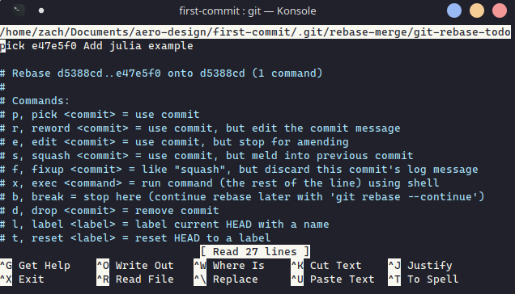

# **Welcome to UWO Aero Design Intro to Git**

This is to serve as a tutorial for onboarding new members who may have never used git before.

The code changes will be incredibly simple but done in a convoluted manner to explain how to use git commands such as add, commit, push, fetch, as well as a short intro to the interactive rebase.

## **Housekeeping**
* Time to complete this tutorial will vary based on how quickly someone can respond to the merge requests. Assuming no wait time:
  * If you already know git, this tutorial should be <30 minutes
  * If you have no experience then expect about 1-2 hours
* Tutorial assumes you have some sort of programming language compiler or interpreter installed on your computer so that you can actually run code.
* The majority of this tutorial will be using the command line, members are free to use GUI based git tools, but they won't be covered here. (It's possible to complete this tutorial using GUI based tools so if you feel more comfortable using them, definitely do so!, there just won't be examples for it)
* This tutorial assumes you have no prior knowledge other than what a terminal is.
* The tutorial was written by someone using Linux, but there is no reason why the steps can't be followed on Mac and Windows, though you may need some extra things on Windows.
  

## **HELP**
If you need help at point during the tutorial dont be afraid to ask. There is a file name HELPME.md which should contain an updated list of people that have already completed the tutorial or are familiar with the material.

It also contains what operating system the person used in case you need operating system specific help. (Though outside the next section, you most likely won't)
  

## **Windows Users**

If you're on Windows computer which I'm assuming most are, I highly recommend installing the Windows Terminal from the Microsoft Store and using powershell.

I would also recommend setting powershell to be the default terminal for VSCode (assuming you use VSCode). This way all terminal commands should be the same across windows, mac, and linux.
  

## **Let's Start**
To begin, lets create a directory to store anything aero design related. Open a terminal and navigate to the directory you want to create your new aero-design folder within. You can do this part with a regular file manager as well.

1. Type `cd path/to/somewhere/` to navigate to inside the `somewhere/` folder. Replace path/to/somewhere with a proper file path

1. Type `mkdir aero-design` to create a new directory

1. Type `cd aero-design` to navigate to inside the directory

*NOTE: `cd` means 'change directory'*

*NOTE: `mkdir` means 'make directory'* 
  

Now lets clone the repository, you can choose either https or ssh, but to use ssh you will have to follow the instructions [here](https://docs.github.com/en/authentication/connecting-to-github-with-ssh/generating-a-new-ssh-key-and-adding-it-to-the-ssh-agent).


Once the link is copied to your clipboard open up a terminal and navigate to your `aero-design/` directory.

Type `git clone <repo-to-clone>` replacing `<x-x-x>` with the text you copied. Remember to hit Enter. You might get prompted for a password.

Type `cd aero-design` once its done cloning 

Finally type `ls` 

*NOTE: `ls` means list files*

*NOTE: `git clone` creates a local version of the repository by copying the files from a remote version (If you are familiar with OneDrive, you can think of this as syncing our device with the files stored in the 'cloud')*

Your Terminal might look something like this now 


## **Branches and 'git checkout'**
If you noticed above, I have the current branch `master` appearing as a part of my prompt. If you don't have that, look up some tutorials online to get it working, it's extremely helpful.

Whenever you clone a repository, you will always be placed on the `master` branch. In the event that you're working and forget the current branch name type:

`git branch --show-current`

Other helpful branch commands are:

* `git branch` to list **local** branches
* `git branch -r` to list **remote** branches
* `git branch -a` to list **all** branches (local and remote)


We never want to do our work on the `master` or `develop` branches. Master branches should only contain completely functional code and is mostly for creating new major versions. Develop branches are for code being prepped for master and is where we first attempt to combine our work into a functional system. Develop will probably be less stable than master but should have many new additions.

That said, let's create a branch to do some work, type:

* `git checkout develop` to switch to the develop branch
* `git checkout -b new-branch-name develop` to create a new branch that splits off from develop (we split off of develop because thats the branch we want to merge back into and also because it has the current features that we want to build off)

When you create a new branch, it automatically puts you on that branch, but if you wanna double check, I've already shown you how up above.


Remember to change new-branch-name to something else. Your initials followed by -onboard is fine for this tutorial.

## **Contributing Code and git { add | push | commit }**

**It's time to make your first contribution**

If you open the fizzbuzz-examples folder, you'll see a bunch folders that have been named based on programming languages.

Each folder will have fizzbuzz example written in that language. To run any of the examples, you'll need to first install the language. If you are completely new to this, I would recommend **python** or **lua**.

At this point, you have a two options. You can:
1. Write another fizzbuzz example in a new language
1. Write anther twosum example in a new language
1. Install one of the languages for which an example was written and modify the existing example.

If you choose 1 or 2 look at the previous examples and follow their structure. Remember to include the language site for installation and how to run the program on Windows, Linux and macOS.

If you choose 3 your task is to simply change the multiples that fizz and buzz are printed on or change the target and data array of twosum.

You can open VSCode from the command line using `code .` and make your changes.

Both of these are fairly simple, and the point of this tutorial is to teach git so I wont be showing you how to write/change the code.
My contribution will be a new fizzbuzz example written in julia.

### The current files are:


### New will be:


As you can see, the newly add files are automatically highlighted by VSCode. The color may be different but 'U' means that the file is not tracked by git (Currently Unknown).

### Here is the completed example:

  
### **GIT ADD**
To contribute code to the repository we must first prepare the code that we wish to push. This is done by:

* Type `git add .` to stage all your changes
* Type `git add file-name/` to stage all changes to a specific file
* Type `git add -p` to add specific lines (**advanced**)


I only made a change to one file so there is no harm by doing the first one.

### **GIT COMMIT**
Once the modified code has been prepped we can write an explanation for the changes:

* Type `git commit` (Opens nano editor)
* Type `git commit -m "commit title"` (leaves empty message body)


  


nano might seem confusing but its actually really simple. The first line is your commit title, leave a blank line and then write a body for the commit message. Once you're done the options are listed at the bottom.

* Type `ctrl + o` and hit enter to save the commit message
* Type `ctrl + x` to then leave the nano editor

When you exit, you should see some output like the following
We can see:
* The branch name
* Commit hash
* Summary of changes
```
[zd-onboard f8f00ca] Add julia example
 1 file changed, 29 insertions(+)
 create mode 100644 git-intro/fizzbuzz-examples/julia/fizzbuzz.jl
```

### **GIT PUSH**

The changes you have made so far are still only on your computer. If someone wants to see the work you have done and use it for themselves, it needs to be available on the remote repository.

Type `git push origin branch-name` and hit enter
You'll be given a bunch of output, as long as there are no errors, everything is okay

```
...Documents/aero-design/first-commit on zd-onboard  took 4m4s 
04:31:17 PM    git push origin zd-onboard
Enumerating objects: 9, done.
Counting objects: 100% (9/9), done.
Delta compression using up to 8 threads
Compressing objects: 100% (5/5), done.
Writing objects: 100% (6/6), 772 bytes | 772.00 KiB/s, done.
Total 6 (delta 2), reused 0 (delta 0)
remote: Resolving deltas: 100% (2/2), completed with 2 local objects.
remote: 
remote: Create a pull request for 'zd-onboard' on GitHub by visiting:
remote:      https://github.com/UWO-Aero-Design/first-commit/pull/new/zd-onboard
remote: 
To github.com:UWO-Aero-Design/first-commit.git
 * [new branch]      zd-onboard -> zd-onboard
```

And now if we go look on github, we should see your branch there, use the Dropdown menu to switch to it. (Ignore the commits ahead of master on mine)

You can see that for the fizzbuzz-examples folder, the most recent commit was the "Add julia example" which we just wrote.


At this point we could make a pull/merge request to move our changes into develop but first I'm going to introduce the interactive rebase which is an incredibly important git command.

### **GIT REBASE**

**Dont complete this next section unless you have pushed your code to the repository and can see it on github**

Let's say you aren't very happy with having the range be 1-100 and would rather have 75-200 or you dont like that the values you just chose for fizz and buzz.

We could modify them and then add our new changes, make a new commit and then push it but then we would have two different commits for what is ultimately the same thing, the previous commit has no value.

Instead we will use the interactive rebase to overwrite our previous commit.

First make sure your code file is open in an editor. (`code .` if you have VSCode)

Type `git rebase -i HEAD~1` to say we want to modify the last 1 commit from our current point in time (HEAD). The `-i` option means interactive. You'll get a screen like this (It's nano again):


You can see our commit, if we had more commit and specified HEAD~x we would have seen x commit there.

Underneath it are a bunch of commands we are allowed to use. We want to modify the actual code in our commit so we will use `edit`. Do this by replacing

```
pick e47e5f0 Add julia example
```

with 

```
edit e47e5f0 Add julia example
```
Then hit `ctrl+o` , `enter` , and `ctrl+x`

Nano will exit and the terminal should have a message like the following:

```
...Documents/aero-design/first-commit on zd-onboard  took 1m49s 
06:06:09 PM    git rebase -i HEAD~1
Stopped at e47e5f0...  Add julia example
You can amend the commit now, with

  git commit --amend 

Once you are satisfied with your changes, run

  git rebase --continue

```

Go into your editor and start making the changes you want, I am going to change the range to be between 75 and 200 but feel free to change any of the variables. Remember to save your changes before proceeding.

Now go back to your terminal and type

* `git add modified-file-name`
* `git rebase --continue`

Nano will appear again, and our original commit message will be on the screen. You can change the commit title or message if your changes need to reflected here. Once your satisfied type:

Then hit `ctrl+o` , `enter` , and `ctrl+x` (This is the last time I'll be writing that)

```
...Documents/aero-design/first-commit on HEAD  (e47e5f0) (rebase 1/1) [+1] 
06:23:57 PM    git rebase --continue### **GIT REBASE**
[detached HEAD df2bfa9] Add julia example
 Date: Sun Jan 30 16:27:12 2022 -0500
 1 file changed, 29 insertions(+)
 create mode 100644 git-intro/fizzbuzz-examples/julia/fizzbuzz.jl
Successfully rebased and updated refs/heads/zd-onboard.
```

Now we need to push our changes back to the remote again.

You can try it using the command from before but youll get an error


When we do a rebase that modifies the repository, we modify the commit history, this changes all the edited commit hashes to different values. This means that our branch no longer looks like the one on the remote and since the commits don't match up anywhere. But we don't want the version on the remote, our local changes are definitely correct, so instead we have to do a force push.

Force pushes are dangerous so only ever do it when no one else is working on the same branch as you. We created a new branch to complete this tutorial so it'll be okay.

`git push --force origin branch-name`

And now the push will work. **Don't make a merge request yet though!** We wanna do one last thing before that so we can really drill down interactive rebasing. Just continue to the next section for now.

### **HELPME.md**

Since you're obviously qualified to walk other people through the tutorial now, how about adding you name to the list of people who have completed this tutorial.

This is a new change that is completely seperate from the last one so we should create a new branch to do this. Switch back to the develop branch and create a new branch off of it for updating the HELPME.md file. *Replace zd with your initials*

`git checkout develop`

`git checkout -b zd-update-help develop`

